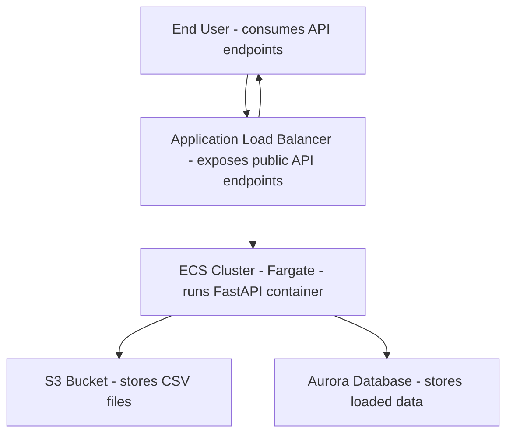
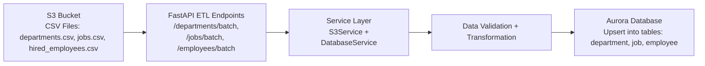
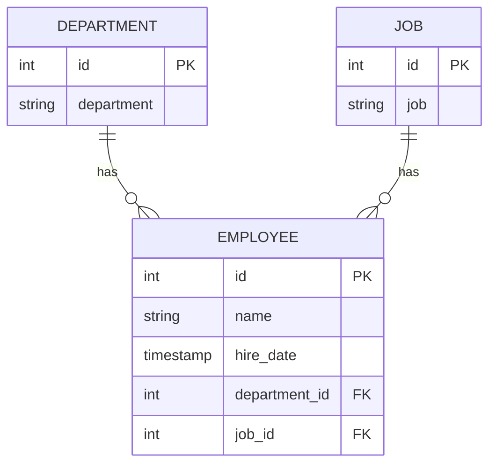

# Globant Data Engineering Challenge

## 📋 Description

FastAPI application to process employee data from CSV files stored in S3 and store them in a database. The application is designed to be deployed on AWS ECS with Fargate, using cloud-native security and deployment best practices.

## 🏗️ Architecture



## 🔄 ETL Process Diagram


   
## 🗃️ Entity-Relationship Diagram



## 🚀 Features

### ✅ Implemented
- **FastAPI Application**: REST API with endpoints for departments, jobs and employees
- **Batch Processing**: Endpoints to process CSV files in batches (1-1000 rows)
- **Data Models**: SQLModel for departments, jobs and employees with proper relationships
- **S3 Connection**: Service class to read files from S3 buckets
- **Database Connection**: Aurora PostgreSQL with health check
- **Docker**: Container with FastAPI and hot-reload for development
- **Docker Compose**: Configuration for local development with PostgreSQL
- **Makefile**: Simplified commands for development and deployment
- **Security**: Uses IAM Task Role for S3 access and AWS Secrets Manager for database URL
- **Database Migrations**: Alembic integration for automated database schema management
- **Automated Setup**: Entrypoint script for automatic migration application on container startup
- **Pagination**: GET endpoints support pagination for better performance and user experience
- **Batch All Tables**: Endpoint to process all CSV files simultaneously
- **Scalable S3 Structure**: CSV files organized in folders by model class for better scalability
- **Analytics & Metrics**: Database views and endpoints for data analytics
- **SQLModel View Models**: Type-safe models for database views with pagination support

### 🔧 Available Endpoints

#### Health & Status
- `GET /` - Root endpoint
- `GET /health-db` - Health check for database connection
- `GET /health-s3` - Health check for S3 connection and file listing

#### Data Processing
- `POST /departments/batch` - Process departments from CSV file (departments.csv)
- `POST /jobs/batch` - Process jobs from CSV file (jobs.csv)
- `POST /employees/batch` - Process employees from CSV file (hired_employees.csv)
- `POST /all-tables/batch` - Process all CSV files simultaneously

#### Data Retrieval
- `GET /departments` - List all departments (with pagination)
- `GET /jobs` - List all jobs (with pagination)
- `GET /employees` - List all employees (with pagination)

#### Analytics & Metrics
- `GET /metrics/hired-by-quarter-2021` - Number of employees hired for each position and department in 2021 divided by quarter
- `GET /metrics/top-hiring-departments` - List of departments that hired more employees than the average in 2021

## 🛠️ Technologies Used

- **FastAPI**: Web framework for APIs
- **SQLModel**: Modern ORM for Python
- **boto3**: AWS SDK for Python
- **Docker**: Containers
- **PostgreSQL**: Local development database
- **AWS S3**: File storage
- **AWS ECR**: Container registry
- **AWS ECS/Fargate**: Serverless container orchestration
- **Alembic**: Database migration management
- **sqlalchemy-views**: Database view creation and management

## 🚀 Quick Start

### Prerequisites
- Docker and Docker Compose
- AWS CLI configured with credentials (for local dev)

### Local Development

1. **Clone and setup**
   ```bash
   git clone <repository-url>
   cd globant-data-engineering-challenge
   aws configure
   ```

2. **Create environment file**
   ```bash
   cp env.example .env
   # Edit .env with your configuration
   ```

3. **Run the application**
   ```bash
   make run
   ```

4. **Test the API**
   ```bash
   curl http://localhost:8000/
   curl http://localhost:8000/health-db
   ```

### Quick Commands
```bash
make run          # Start application
make stop         # Stop application
make logs         # View logs
make test-batch   # Test all endpoints
```

### Documentation
- 📖 [Installation Guide](docs/INSTALLATION.md) - Detailed setup instructions
- 🔧 [Troubleshooting](docs/TROUBLESHOOTING.md) - Common issues and solutions
- 📚 [API Documentation](docs/API.md) - Complete API reference

## 🔍 Testing

### Production API Docs

You can try the API live in production here:

👉 [Production API Swagger UI](http://globant-challenge-lb-769941458.us-east-1.elb.amazonaws.com/docs)

Quick test commands:
```bash
# Test all endpoints
make test-batch

# Test individual endpoints
curl -X POST "http://localhost:8000/departments/batch"
curl "http://localhost:8000/departments?page=1&size=10"

# Test metrics endpoints
curl "http://localhost:8000/metrics/hired-by-quarter-2021?page=1&limit=5"
curl "http://localhost:8000/metrics/top-hiring-departments?page=1&limit=10"
```

📚 See [API Documentation](docs/API.md) for complete testing examples.

## 📊 Batch Processing Features

- **Batch Size Control**: Configurable batch size (default: 1000 rows)
- **Transaction Support**: Commits per batch, not per row
- **Error Handling**: Robust error handling with detailed logging
- **Upsert Logic**: Insert new records or update existing ones
- **Data Validation**: Automatic validation using SQLModel
- **Performance Optimizations**: Efficient queries and memory management
- **Scalable S3 Structure**: CSV files organized in folders by model class (departments/, jobs/, employees/)
- **Batch All Tables**: Process all CSV files simultaneously with single endpoint
- **Pagination Support**: GET endpoints support pagination for better performance

## 📈 Analytics & Metrics Features

- **Database Views**: Optimized SQL views for complex analytics queries
- **SQLModel Integration**: Type-safe models for database views with pagination support
- **Consistent Response Format**: Standardized pagination metadata across all endpoints
- **sqlalchemy-views**: Elegant database view creation and management

## 🗄️ Database Migrations

- **Alembic Integration**: Automated database schema management
- **Automatic Migrations**: Migrations applied automatically on container startup
- **SQLModel Support**: Full integration with SQLModel for type-safe migrations
- **Production Ready**: Works seamlessly in both development and production environments
- **Zero Downtime**: Safe for production deployments with automatic rollback support

## 📝 Next Steps

- [ ] Implement CI/CD pipeline
- [ ] Optimize memory usage in the insertion process
- [ ] Implement unittests

## 🤝 Contributing

1. Fork the project
2. Create a feature branch (`git checkout -b feature/AmazingFeature`)
3. Commit your changes (`git commit -m 'Add some AmazingFeature'`)
4. Push to the branch (`git push origin feature/AmazingFeature`)
5. Open a Pull Request

## 📄 License

This project is under the MIT License - see the [LICENSE](LICENSE) file for details.
